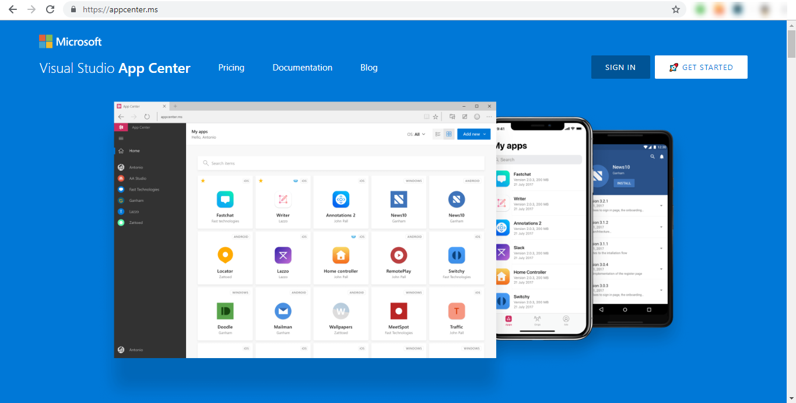
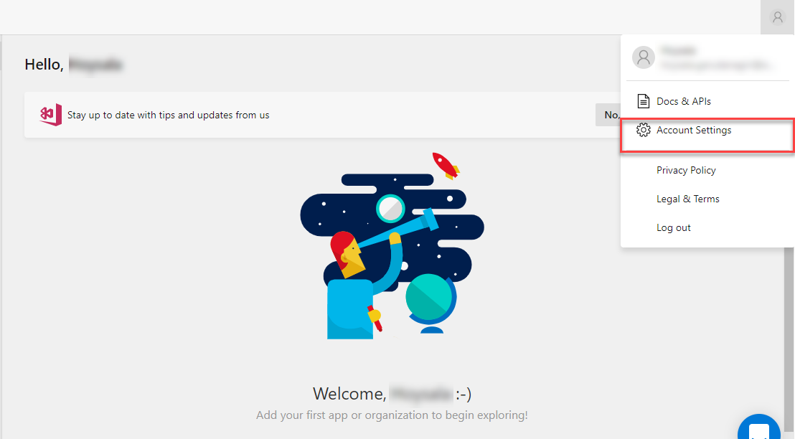
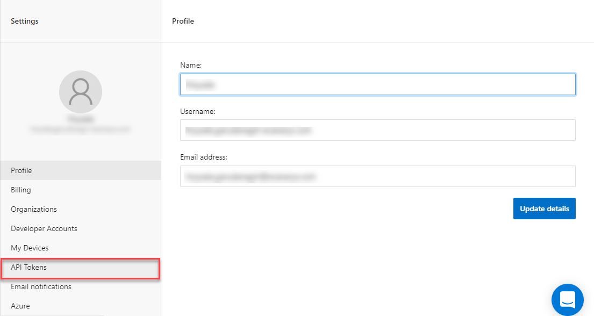
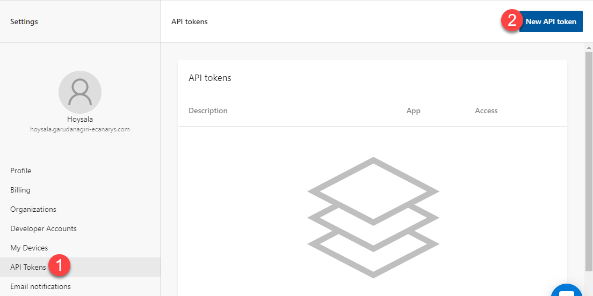
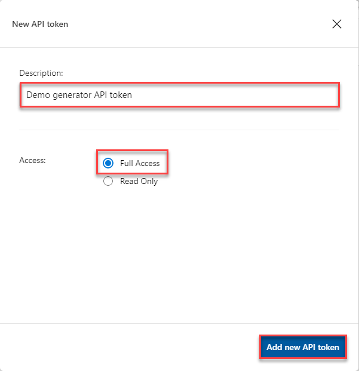
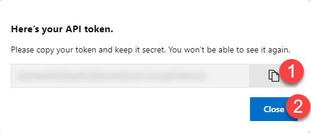

# Generating API Token for App Center

1. Navigate to <a href="https://appcenter.ms">App Center</a> and login with your account information. 

    

1. On the top right corner of the App Center portal, click your account user name, then select **Account Settings**.

    

1. In the middle frame of the page, select **API Tokens** from the menu list.

    

1. On the top right corner, click **New API token**.  

    

1. Provide a descriptive description, choose **Full Access** radio button and click **Add new API token**. A *Full Access* API token has all the permissions that the associated user has for that app.

    

1. This will generate a pop up with your API token. Copy and store it in a secure location for later use. For security reasons, you will not be able to see or generate the same token again after you click the **Close** button. Click *Close* to close the dialog.

    