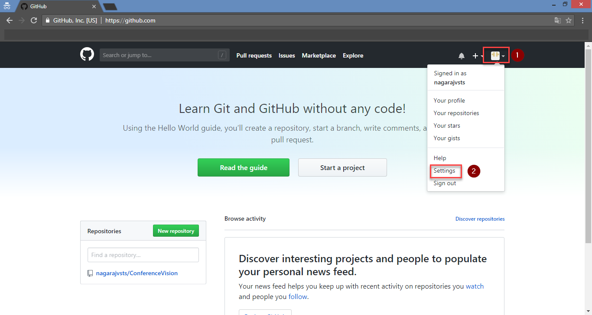
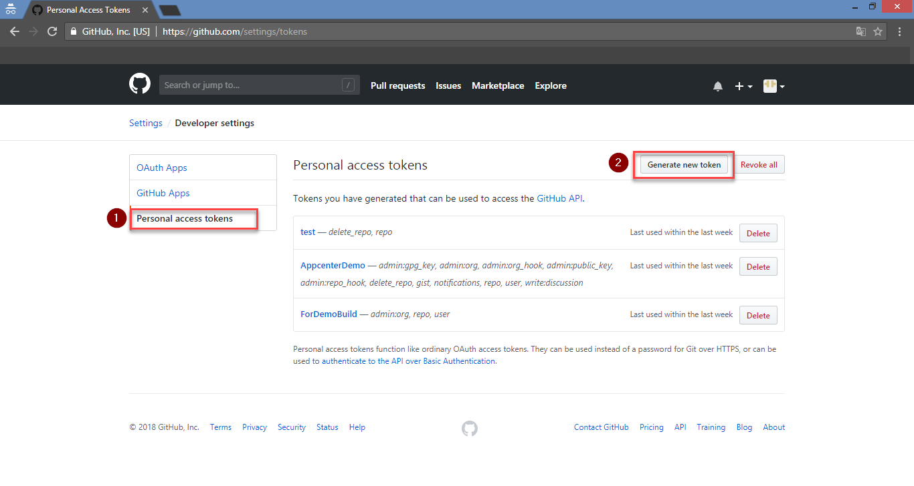
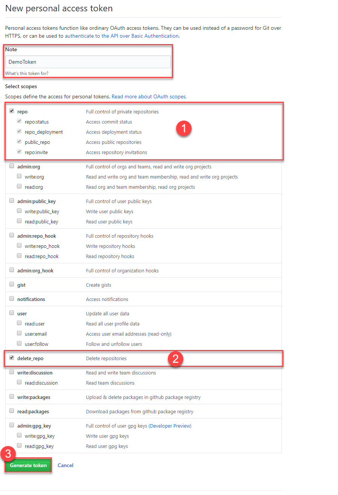
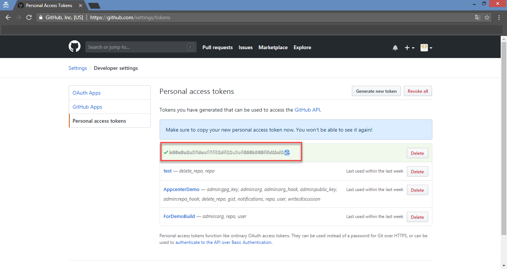

# Generate Personal Access Token (PAT) for GitHub

1. Navigate to [GitHub](https://github.com), click the profile icon and then choose **Settings**.

    

1. Click the **Developer settings** option.

    

1. Select **Personal Access Tokens** option and select **Generate New Token**.

    

1. Provide a description and select **repo** scope, click **Generate token**.

    

1. **Copy** the generated Personal access token and save it to a notepad to be used later.

    
