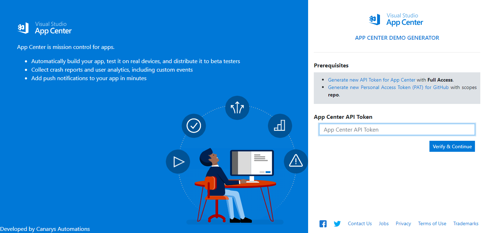
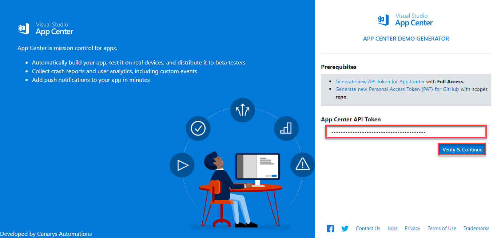
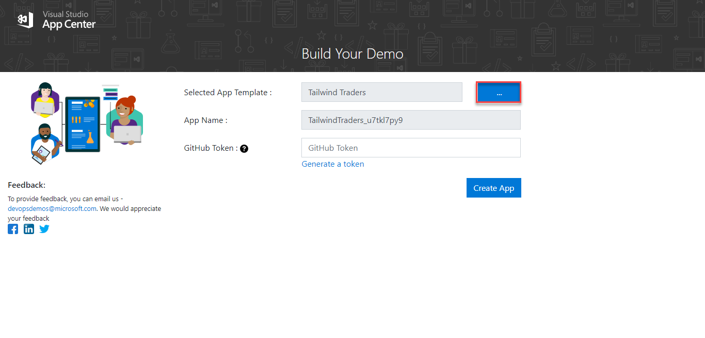
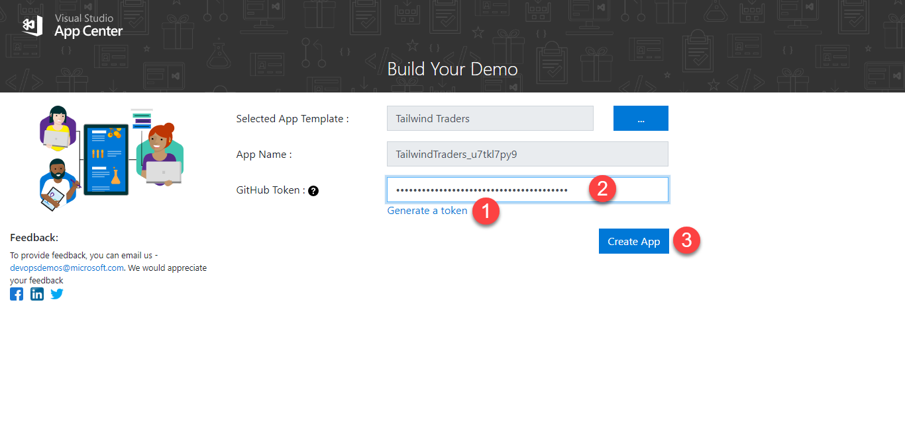
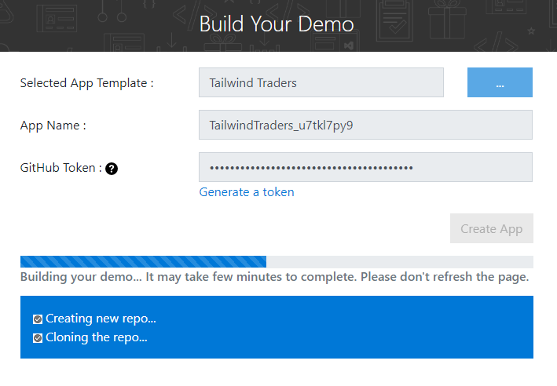
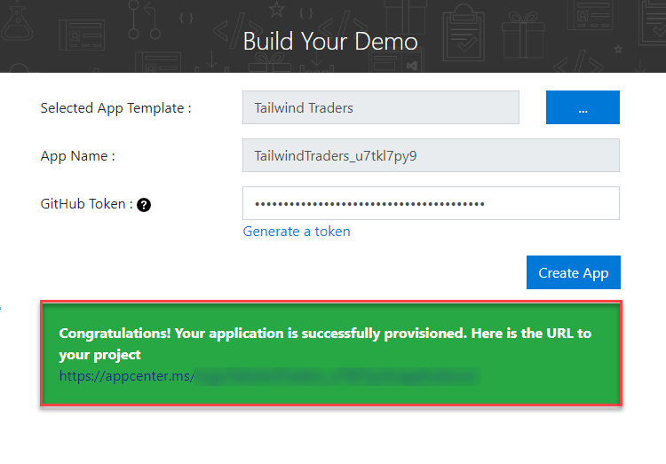
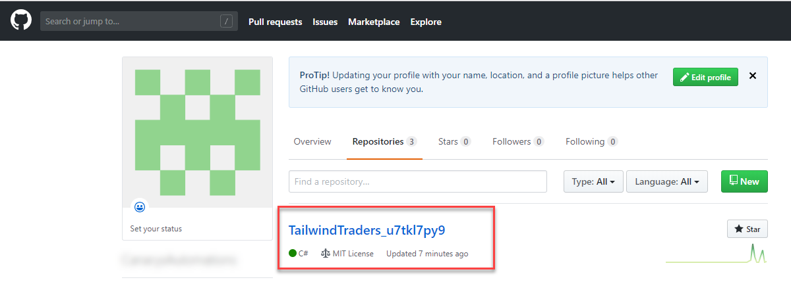
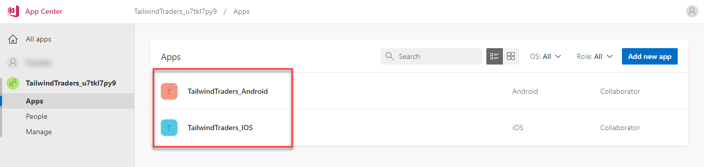

# App Center Demo Generator 

## Overview

This document outlines the instructions to configure and use the App Center Demo Generator.

## Before you begin

You must have the following information - 

  * API Token with *Full Access* to the App Center
  * Personal Access Token (PAT) for GitHub with *repo* scope
  
## Walkthrough

1. Open [App Center Demo Generator](https://appcenterdemogenerator.azurewebsites.net/) site on your browser. Click the links in the **Prerequisites** section to generate the keys.

    

1. Enter the valid **App Center API Token** in the **App Center API Token** text field and click the **Verify & Continue** button.

    

1. In the resulting page, you can choose from a number of templates by clicking the **...** *ellipsis* button next to **Selected App Template** field and select a template to create the app. **Tailwind Traders** is the default selected template.

    

1. Once the template is selected, a name for the application is auto generated. Enter the valid GitHub token that was created previously. If you haven't created the token yet, click the **Generate a token** to generate a token with **repo** access. Click the **Create App** button.

    

1. Once the process starts, you should be able to see status messages appearing in the page indicating the process of each step that the demo builder performs. 

    

1. Once the application is provisioned successfully, you should see a success message with the App Center URL for the provisioned application.

    

1. A **repository** with the source code will be created in the GitHub account that was provided and will be used in the build configuration of application.

    

1. Navigate to the AppCenter portal by clicking the URL that has been generated after the application was successfully provisioned.

    

