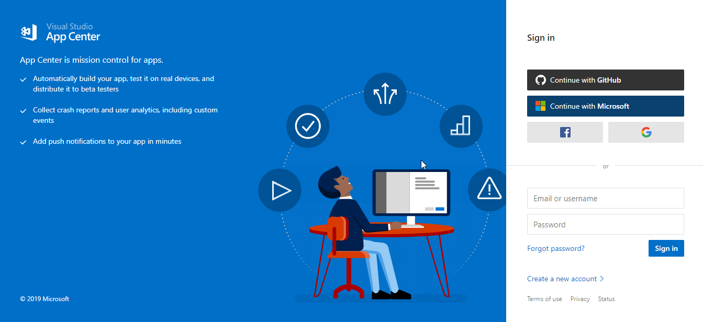
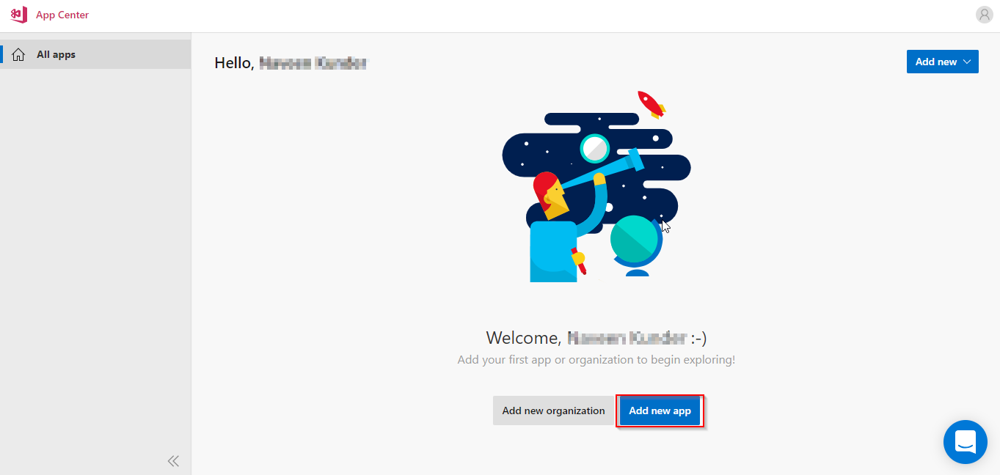
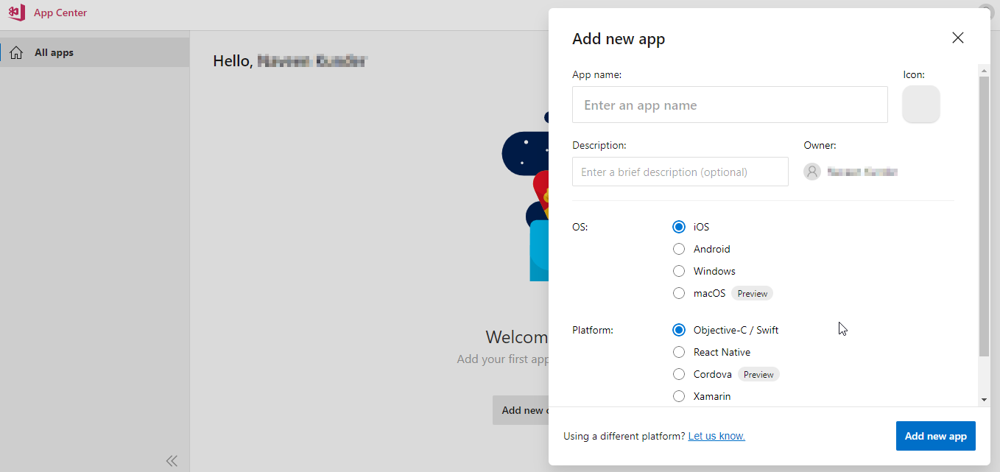
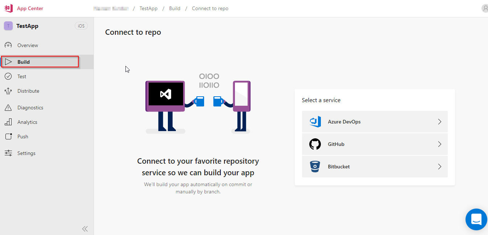
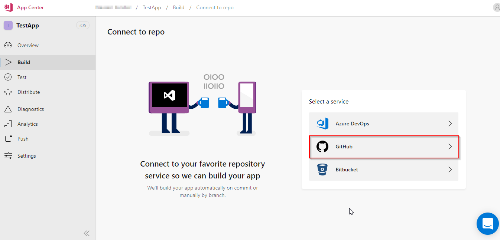
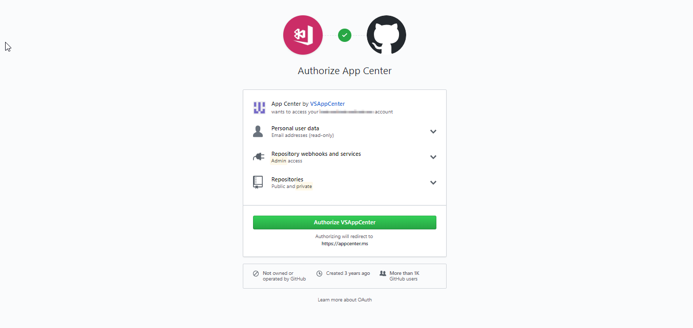
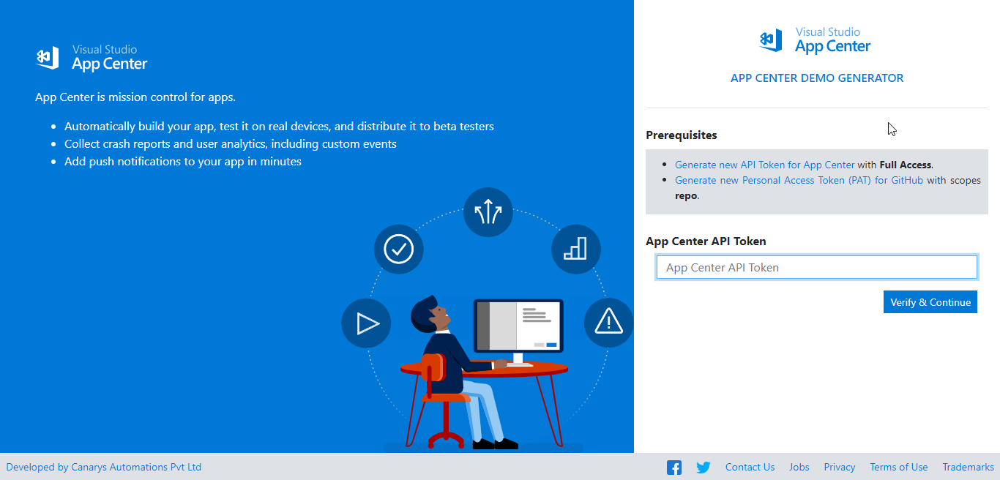

# Link AppCenter and GitHub

1.  Navigate to <a href="https://appcenter.ms/apps">App Center</a> and login with your account information. 

    
1. 	Click on **Add New App**.

    

1. 	In **Add new app** dialog enter **App name** and click **Add new app**.

    

    > We are creating a sample app here to link the **App Center** with the **GitHub** account.

1. Now go to the **Build** tab in the app created. 

    

1. 	Select **GitHub** under **Select a service** section.

    

1. 	You will be prompted to sign in to your **GitHub** account. Enter your GitHub credentials.

    

1. Click on **Authorize VSAppCenter** to authorize **App Center** with your **GitHub** account.

    

1. 	You have successfully linked App Center with your GitHub. Now you can try using the <a href="https://appcenterdemogenerator.azurewebsites.net/">App Center Demo Generator</a> to create an app.

    

